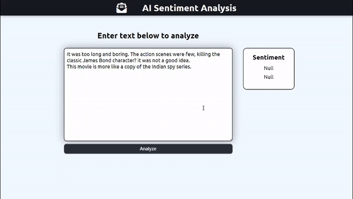
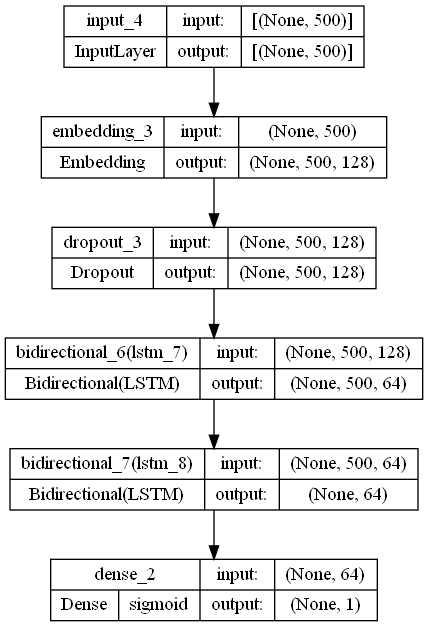
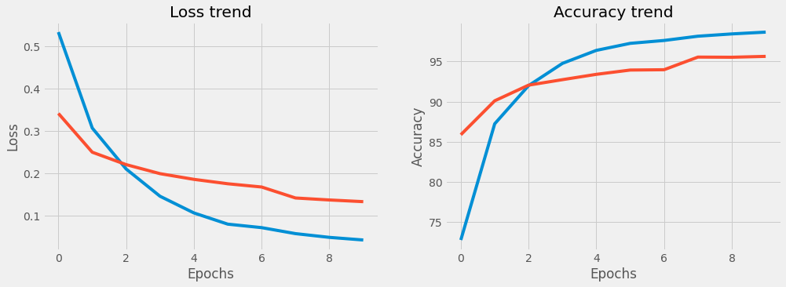

# IMDB Sentiment Analysis

Subsets of IMDb data are available for access to customers for personal and non-commercial use.

## Introduction

Given the availability of a large volume of online review data (Amazon, IMDB, etc.), sentiment analysis becomes increasingly important. In this project, a sentiment classifier is built which evaluates the polarity of a piece of text being either positive or negative.

## Data Location

The dataset files can be accessed and downloaded from [here](https://www.kaggle.com/datasets/lakshmi25npathi/imdb-dataset-of-50k-movie-reviews/download).

## IMDb Dataset Details

IMDB dataset having 50K movie reviews for natural language processing or Text analytics.
This is a dataset for binary sentiment classification containing substantially more data than previous benchmark datasets. This a set of 25,000 highly polar movie reviews for training and 25,000 for testing. So, predict the number of positive and negative reviews using either classification or deep learning algorithms.
For more dataset information, please go through this following [link](http://ai.stanford.edu/~amaas/data/sentiment/)

## Model

|Metrics| Precision | Recall | Accuracy |
|:-:|:-:|:-:|:-:|
|Testing|0.949|0.961|0.955|

## Usage

Feel free to use the model and your own dataset.

## Getting Started

If you want to run the application locally use following steps -

- git clone `https://github.com/darthdaenerys/IMDB-Sentiment-Analysis.git`
- Navigate to the project directory: `cd IMDB-Sentiment-Analysis`
- Install Python dependencies: `pip install -r requirements.txt`
- Move to backend directory `cd backend`
- Install Node.js dependencies(open another terminal): `npm install`
- Start the server: `node index.js`
- Move back to parent directory `cd ..`
- Install react dependencies `npm install`
- `npm start` Runs the app in the development mode.\
Open [http://localhost:3000](http://localhost:3000) to view it in your browser.
